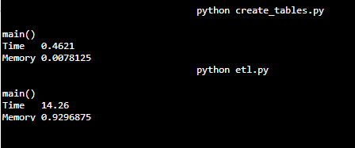
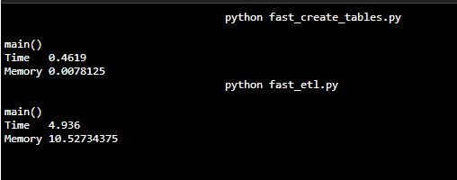

# Improving time to execute

Inspired by these two articles:
-   [fast-load-data-python-postgresql](https://hakibenita.com/fast-load-data-python-postgresql).
-   [Pandas to PostgreSQL using Psycopg2: Bulk Insert Performance Benchmark](https://naysan.ca/2020/05/09/pandas-to-postgresql-using-psycopg2-bulk-insert-performance-benchmark/)

I tried to utilize appropriate psycopg2 built-in functions to imporve insert timing. To do that I choosed the [`copy_from`](http://initd.org/psycopg/docs/cursor.html#cursor.copy_from) command which need csv file and for that I created custom function to create csv file form 2 foms of data type (lists and pandas dataframe) 

### New_files

- **fast_sql_queries.py** similar to the old queries but I change the insert statements structure a bit to be used correctly.
- **fast_create_tables.py** this is the same code as before but it uses **fast_sql_queries**.
- **fast_etl.py** This is a newly script crafted to increase time performance by reading all the files and collecting the data appropriatly then bulk insert using `copy_from` function into the database.
-  **fast_etl.ipynb** The notebook used to test and explore the code.
- **monitor_script.py** Containing the function to monior memory and time consumed by the script
 
## Prerequisites

-	This project uses different libiraries included in fast_requirments.txt=
-   A PosgreSQL database is available on localhost

## Running the Python Scripts

At the terminal:

1.  `python fast_create_tables.py`
2.  `python fast_etl.py`

In IPython:

1.  `run fast_create_tables.py`
2.  `run fast_etl.py`

## Comparison

- First I ran the old script to monitor its performance also, I commented out the print statements in the code. 

- Secondly, I run the new scripts

## Results

**As seen there is a huge time decrease for the new script but also there is a huge increase in memory consumption. I belive it is mainly because the use of pandas dataframe**